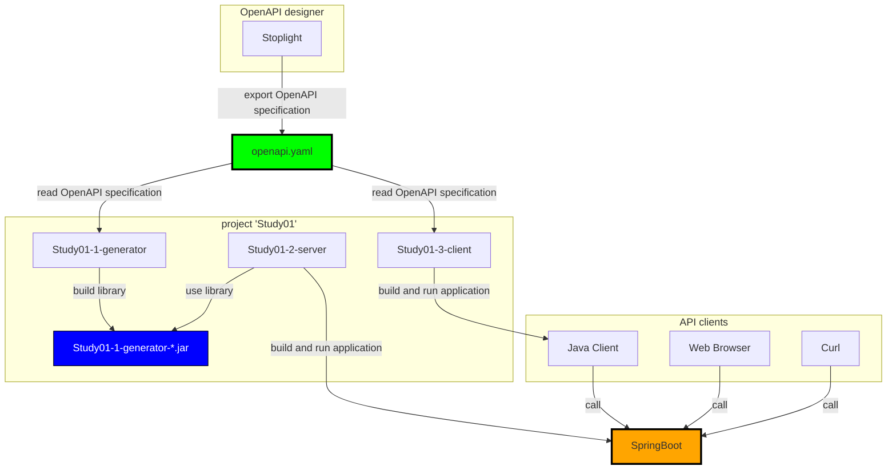

```mermaid
flowchart TD
 subgraph OpenAPI designer
  STL[Stoplight]
 end
 YAML[openapi.yaml]
 subgraph project 'Study01'
  GEN[Study01-1-generator]
  LIB[Study01-1-generator-*.jar]
  SER[Study01-2-server]
  CLI[Study01-3-client]
 end
 SBT[SpringBoot]
 subgraph API clients
  JCL[Java Client]
  WBR[Web Browser]
  CURL[Curl]
 end
 
 STL --> |export OpenAPI specification| YAML:::greenBox
 YAML --> |read OpenAPI specification| GEN
 YAML --> |read OpenAPI specification| CLI
 CLI --> |build and run application| JCL
 GEN --> |build library| LIB:::blueBox
 SER --> |use library| LIB
 SER --> |build and run application| SBT:::orangeBox
 JCL --> |call| SBT
 WBR --> |call| SBT
 CURL --> |call| SBT
 
 classDef greenBox   fill:#00ff00,stroke:#000,stroke-width:3px
 classDef blueBox    fill:#0000ff,stroke:#000,stroke-width:1px,color:#fff
 classDef orangeBox  fill:#ffa500,stroke:#000,stroke-width:3px
```